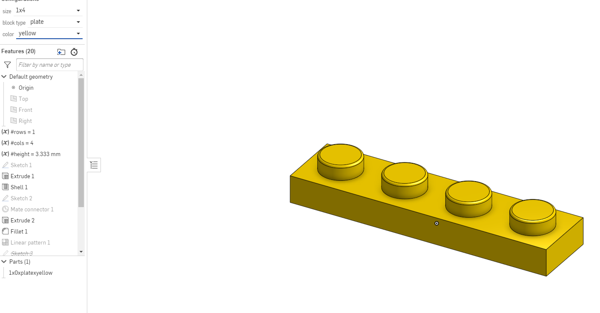

# OnshapeCAD

## Table of Contents
* [Table of Contents](#TableOfContents)
* [CAD_Swing_Arm](#CAD_Swing_Arm)
* [Skateboard](#Skateboard)
* [Deck](#Deck)
* [Trucks](#Trucks)
* [Wheels](#Wheels)
* [Lego pieces](#Lego_pieces)
* [Configurations](#Configurations)
* [Duck](#Duck)

## CAD_Swing_Arm 

### Description

This assignment asked me to replicate a swing arm part from a set of drawings. The assignment style is similar to a portion of the Onshape Associate Certification test.

### Pictures 

Configuration #1

Configuration #2

Credit for the pictures goes to

[millerm22](https://github.com/millerm22)
### Link
[Swing Arm Part](https://cvilleschools.onshape.com/documents/e353807ba7e587d436412646/w/c19efe9f27fba69a69b56a1b/e/0c2ff10114b5de050efd034b)

### Reflection
This assignment was very hard and took me a long time to finish it. I hope to improve greatly by the onshape certification exam.
# Skateboard

## Deck

### Description
Ths part is the base of the skateboard one would stand on. it was a hole toll and 2 circles combined with a rectangle.
### Picture

### Link

[Document](https://cvilleschools.onshape.com/documents/7d7c99d7713d562d2ec6435f/w/ed540bc54d34140531a987b5/e/5a733f9b518e3d6235382ca9?renderMode=0&uiState=616dc8b0a2329723abe91423)

### Reflection
The base was very simple to make it was simple a few rectangles and 2 circles with holes in them. The two useful shortcuts were n and p for toggles planes and normal to.

## Trucks

### Description
This represents the bottom part of he skateboard which connects the wheels and skateboard. it was a large quantity of extrusions and circles as well as a handful of fillets.
### Picture

### Link

[Document](https://cvilleschools.onshape.com/documents/7d7c99d7713d562d2ec6435f/w/ed540bc54d34140531a987b5/e/5a733f9b518e3d6235382ca9?renderMode=0&uiState=616dc8b0a2329723abe91423)

### Reflection
During the trucks I made a mistake at some point and learned the important difference between a surface extrusion and a part extrusion.

## Wheels

### Description
This is the wheels and the bearings for the assembly
### Picture

### Link

[Document](https://cvilleschools.onshape.com/documents/7d7c99d7713d562d2ec6435f/w/ed540bc54d34140531a987b5/e/5a733f9b518e3d6235382ca9?renderMode=0&uiState=616dc8b0a2329723abe91423)

### Reflection
The wheels were very simple and quick to make.

## Assembly

### Description

This is the combination of all of the parts
### Picture

### Link

[Document](https://cvilleschools.onshape.com/documents/7d7c99d7713d562d2ec6435f/w/ed540bc54d34140531a987b5/e/5a733f9b518e3d6235382ca9?renderMode=0&uiState=616dc8b0a2329723abe91423)

### Reflection
The assembly was very simple to put together. I liked the batch fill option on Onshape.

## Additions

### Description

This added a logo as well as the addition of a bend in the board
### Picture

### Link

[Document](https://cvilleschools.onshape.com/documents/7d7c99d7713d562d2ec6435f/w/ed540bc54d34140531a987b5/e/5a733f9b518e3d6235382ca9?renderMode=0&uiState=616dc8b0a2329723abe91423)

### Reflection
this part was a little confusing and it took me a little bit to figure out how to embed it into the board but the cut tool was easy to use.

## Lego_pieces

### Description
Just a simple red Lego brick with a linear pattern and an extrude with a fillet
### Picture

### Link

[document](https://cvilleschools.onshape.com/documents/c7d7475abdd148eda882e2c0/w/ddaf50f9af35df975fd694a6/e/4f755a69f033e046510ba956)

### Reflection
This part was quick to make the only new part was the introduction of a few variables

## Configurations

### Description
the settings to make it any required size were made so you can have any type of piece
### Picture

### Link

[document](https://cvilleschools.onshape.com/documents/c7d7475abdd148eda882e2c0/w/ddaf50f9af35df975fd694a6/e/4f755a69f033e046510ba956)

### Reflection
this part was more complicated because I needed to learn to use configurations and learned that one must click the setting they wish to put into it and not just the part as a whole.

## Duck

### Description

### Picture

### Link

[document](https://cvilleschools.onshape.com/documents/c7d7475abdd148eda882e2c0/w/ddaf50f9af35df975fd694a6/e/4f755a69f033e046510ba956)

### Reflection
the assembly was a tad weird but snap mode was not hard outside of the failure of snapping which happened accidently sometimes.

## Multi-tool

### Description

this is a multi-tool that can measure distances as well as a protracter and can also screw things in.

### Picture

### Link

[multi-tool](https://cvilleschools.onshape.com/documents/54578d8539296fcc0d037657/w/a3231cfc037cdefb4a88ed74/e/229a352f9988c1a3956ff68c)

### Reflection

This was relatively simple to draw from the sketch this time and it was much easier than the joint I had to draw earlier.
